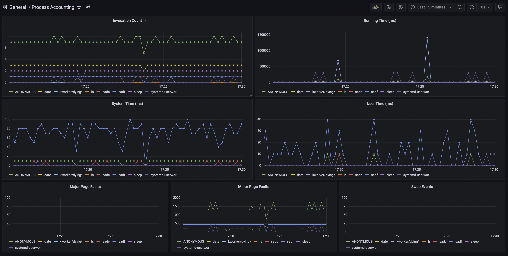
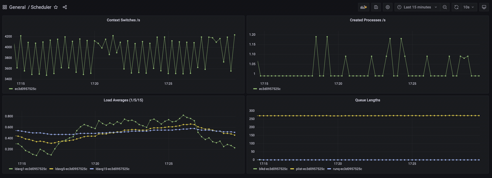
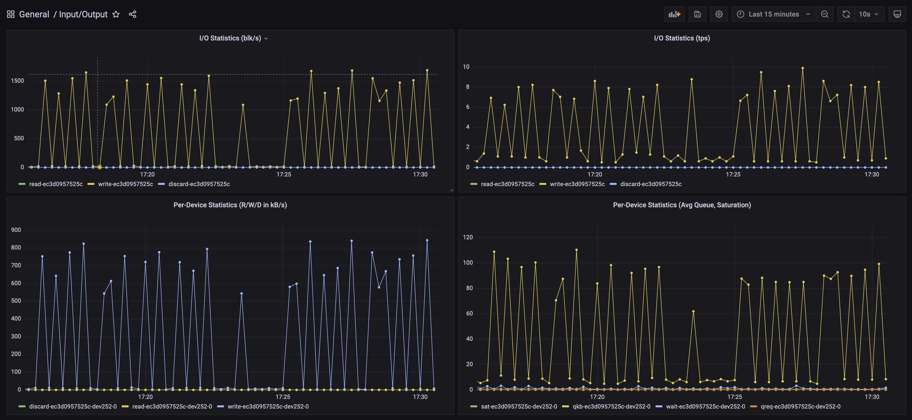

= Linux Metrics Exporter for OpenShift Nodes =

== Components ==

. Container Image for SAR
. Container Image for PSACCT
. Container Image for Exporter

== How It All Works ==

Very simple: two sidecar containers, `collector-sysstat` and
`collector-psacct`, produce data on a shared ephemeral volume, and the third
container, `metrics-exporter`, consumes the data and exposes it on the
`/q/metrics` endpoint where Prometheus can pick them up.

The specific thing about how the entire composition works is that care has been
taken, especially with `psacct` (which can grow excessively during periods of
high activity), that accounting files are regularly truncated or moved out of
the way in order to keep the disk space utilisation as low as possible.

== OpenShift Deployment ==

The easiest? Just use `Kustomize` to deploy existing resource definitions from
the `exporter` manifest in `deployment/`:

[subs=+quotes]
------
$ *oc apply -k ./deployment/exporter/base/*
------

The above will create everything in the `exporter` project. If you need to
change that, or some other settings, feel free to have a look at the `custom`
kustomization next to `base`, then apply it instead of the base set of
resources.

[subs=+quotes]
------
$ *cat deployment/exporter/custom/use-custom-namespace.yml*
apiVersion: builtin
kind: NamespaceTransformer
metadata:
  namespace: *my-very-own-namespace*
setRoleBindingSubjects: allServiceAccounts
fieldSpecs:
  - path: metadata/name
    kind: Namespace

$ *oc apply -k ./deployment/exporter/custom/*
------

You should have Prometheus deployed somewhere prior to that though, so you
might want to have a look at least at the kustomizations for the `integrate`
manifest in order to target the right places.

TBD

If you still need to deploy Prometheus, there is a sample manifest in there as
well. Two, actually. One to deploy the Prometheus and Grafana operators (you
won't believe it, it's called `operators`), and once those are running, you can
use the other one (called very innovatively `prometheus`) to deploy their
actual instances. That, will also target the `prometheus` OpenShift project, so
kustomize away if that's not what you want.

== Standalone Containers ==

Start the composition.

// TODO: podman pod

[subs=+quotes]
------
$ *podman volume create metrics*
metrics

$ *podman run -d --rm -v metrics:/var/account --cap-add SYS_PACCT --pid=host collector-psacct:latest*
dd9f4825d23614df2acefdcd70ec1e6c3ea18a58b86c9d17ddc4f91038487919

$ *podman run -d --rm -v metrics:/var/log/sa collector-sysstat*
ec3d0957525cc907023956a185b15123c20947460a48d37196d511ae42de2e27

$ *podman run --name exporter -d --rm -v metrics:/metrics -p 8080:8080 metrics-exporter*
d4840ad57bfffd4b069e7c2357721ff7aaa6b6ee77f90ad4866a76a1ceb6adb7

------

Configure prometheus with a data source from the `exporter` container.

[subs=+quotes]
------
$ *podman inspect -f '{{.NetworkSettings.IPAddress}}' exporter
10.88.0.8

$ *tail -n15 tmp-test/prometheus.yml*

scrape_configs:
  # The job name is added as a label `job=<job_name>` to any timeseries scraped from this config.
  - job_name: "prometheus"
    static_configs:
      - targets: ["localhost:9090"]

  **- job_name: "exporter"
    metrics_path: "/q/metrics"
    scheme: "http"
    static_configs:
      - targets: ["10.88.0.8:8080"]
    scrape_interval: 10s
    scrape_timeout: 5s**

------

Add prometheus and grafana.

[subs=+quotes]
------
$ *podman run --name prometheus \*
		*-d --rm \*
		*-v ./test/prometheus.yml:/etc/prometheus/prometheus.yml*
		*-v prometheus:/prometheus \*
		*-p 9090:9090 \*
		*registry.redhat.io/openshift4/ose-prometheus:v4.11*
6eae04677fcded65bbe1cb7f66aa887d94587977a0616f7ec838f9453702474c

$ *podman run --name grafana -d --rm -p 3000:3000 \*
		*-v ./test/grafana.ini:/etc/grafana/grafana.ini \*
		*registry.redhat.io/openshift4/ose-grafana:v4.11*
78d5bfa7977923b828c1818bb877fa87bdd96086cc8c875fbc46073489f6760e
------

Configure grafana with prometheus as the datasource and dashboard away!

.Process Accounting Graphs from a Single Host

.Sysstat Scheduler Information, Single Host

.Sysstat I/O Information, Single Host

== Images ==

This set of images requires a valid entitlement for RHEL (and consequently
either a RHEL system to build on or a RHEL system to create an entitlement
secret from).

IMPORTANT: You do not have to build the images, I have built them for `x86_64` and made them available on `quay.io/benko/`.

=== SAR ===

The _system activity reporting_ image is based on `ubi-minimal` and includes
just the `sysstat` package.

It expects a volume to be attached at `/var/log/sa`.

Entrypoint takes care of initialising the `saXX` files.

// TODO: and rotating any old files out of the way.

It *requires* to be executed under `root` UID (can be rootless, but that may
affect your data depending on host and container configuration).

It also *requires* access to host's network namespace if you want to measure
global network statistics.

// NOTE: When running in a pod, the below is irrelevant as the exporter sets
//	    the hostname, and you can override it there. It does however obtain
//	    the default hostname from data sources.
//
// If aggregating from several hosts, you also need to use the hosts' UTS
// namespace to report correct hostnames, or set the corresponding environment
// variables to override detection.

==== Parameters ====

`PERIOD`::
    Sampling period in seconds. Defaults to `10`. Increase this to something
    like `30` (or more) for hosts with many network interfaces, block devices,
    and/or CPUs.

`STARTUP_SCRATCH`::
    Whether to scratch existing `sa1` data at startup. Defaults to `0`, but
    could be anything except `1`, `yes`, or `true`, which activates it.
    
`STARTUP_ROTATE`::
    Whether to mark data as rotated at startup. Basically just writes a marker
    in the previous `sadc` data file. Defaults to `0`, but could be anything
    except `1`, `yes`, or `true`, which activates it.

=== PSACCT ===

The _process accounting_ image is based on `ubi-minimal` and includes just the
`psacct` package.

It expects a volume to be attached at `/var/account`.

Entrypoint takes care of rotating any old `pacct` files out of the way.

In addition to *requiring* execution under a *real* `root` UID (i.e. *NOT* a
rootless container), it also *requires* the `CAP_SYS_PACCT` capability
(`--cap-add=SYS_PACCT`) and access to host's PID namespace (`--pid=host`).

// NOTE: When running in a pod, the below is irrelevant as the exporter sets
//	    the hostname, and you can override it there. It does however obtain
//	    the default hostname from data sources.
//
// If aggregating from several hosts, you also need to use the hosts' UTS
// namespace to report correct hostnames, or set the corresponding environment
// variables to override detection.

==== Parameters ====

`PERIOD`::
    Sampling period in seconds. Defaults to `10`. Increase this to something
    like `30` (or more) for hosts with many network interfaces, block devices,
    and/or CPUs.

`CUMULATIVE`::
    Tells the collection process to never reset the `pacct` file and just keep
    it growing, thus reporting cumulative stats since container start. Beware
    that the `pacct` file will grow correspondinly large as time goes by.

`STARTUP_SCRATCH`::
    Whether to scratch existing `pacct` data at startup. Defaults to `0`, but
    could be anything except `1`, `yes`, or `true`, which activates it.

=== Exporter ===

The brain of the group.

// TODO: Add support for hostname overrides in app.

// run a maven registry.access.redhat.com/ubi9/openjdk-17 container:
//
// podman volume create maven
//
// podman run -it \
//		    --name exporter \
//		    -v maven:/home/default/.m2/repository \
//		    -v metrics:/metrics \
//		    -v /Users/johndoe/Documents/workspaces/projects/p0f/linux-metrics-exporter/exporter:/exporter \
//		    -p 8080:8080 \
//	    registry.access.redhat.com/ubi9/openjdk-17 bash
//
// $ cd /exporter
// $ mvn quarkus:dev

==== Parameters ====

In `application.properties` or as Java system properties:

`exporter.data.path`::
    Override the location where the metrics files are expected to show up.
    Defaults to `/metrics` but obviously can't be that for testing outside of a
    container.

==== Debugging ====

There are a couple of logger categories that might help you see what's going on.

By default, the routes are fairly noisy, as apparently `TRACE` level logging
doesn't work for some reason, so I had to bump everything up a level, so at
`INFO` you already see a note about every record that's been processed - you
will see their unmarshaled bodies (completely shameless, I know).

These can be bumped up to `DEBUG` if you need more info:

`psacct-reader`::
    The route reading process accounting files from `psacct-dump-all` file.
    Pretty much all the logic is here, but since there can be a large number of
    process records in the file it is split and each record is processed
    asynchronously by the dispatch route.

`psacct-dispatch`::
    The route dispatching the records to the registration service.

`psacct-reset`::
    To be able to work with instantaneous data, rather than cumulative, all
    previously registered records are synchronously reset to zero upon the
    arrival of a new snapshot. This prevents metrics for previously registered
    processes from disappearing.

`sysstat-reader`::
    The route that reads `sysstat-dump.json` file. All the logic is here.

`net.p0f.openshift.metrics`::
    Non-camel stuff is all logged in this category.

=== Building with Podman ===

If building the images using `podman` on an entitled host, no extra steps need
to be performed as host entitlements will automatically be imported into the
build container.

NOTE: When building for an architecture without the `ubi-minimal` image or on a
host that can not be entitled (f.e. Fedora CoreOS), you can choose a different
base image by using the `--from` option in `podman build`.
[subs=+quotes]
-------------------------------
$ *podman build --from=registry.fedoraproject.org/fedora-minimal:36 -f ./images/Containerfile-sysstat -t collector-sysstat:latest*
-------------------------------

You will have noticed there is no `Containerfile` for exporter. That is because
`quarkus-maven-plugin` can do just fine
https://quarkus.io/guides/container-image[building an image on its own]. Just
add the `jib` extension and tell it to push the image somewhere.

[subs=+quotes]
-------------------------------
$ *mvn package -Dquarkus.container-image.build=true -Dquarkus.container-image.push=true -Dquarkus.container-image.registry=foo*
-------------------------------

=== Building in OpenShift ===

==== Collector Images ====

If building the images in OpenShift Container Platform, you must make sure an
entitlement secret and corresponding RHSM certificate secret are mounted inside
the build pod in order for packages to be found and installed.

NOTE: The entitled system architecture needs to match the container host!

The process is as follows.

.Verify access to host entitlement data.
[subs=+quotes]
-------------------------------
$ **ls -l /etc/pki/entitlement/*.pem /etc/rhsm/ca/*.pem**
-rw-r--r--. 1 root root   3272 Oct 31 06:09 /etc/pki/entitlement/_6028779042203586857_-key.pem
-rw-r--r--. 1 root root 149007 Oct 31 06:09 /etc/pki/entitlement/_6028779042203586857_.pem
-rw-r--r--. 1 root root   2305 Sep  2  2021 /etc/rhsm/ca/redhat-entitlement-authority.pem
-rw-r--r--. 1 root root   7411 Sep  2  2021 /etc/rhsm/ca/redhat-uep.pem
-------------------------------

.Create corresponding secrets.
[subs=+quotes]
-------------------------------
$ *oc create secret generic etc-pki-entitlement \*
    *--from-file=/etc/pki/entitlement/_6028779042203586857_-key.pem \*
    *--from-file=/etc/pki/entitlement/_6028779042203586857_.pem*
secret/etc-pki-entitlement created

$ *oc create secret generic rhsm-ca \*
    *--from-file=/etc/rhsm/ca/redhat-entitlement-authority.pem \*
    *--from-file=/etc/rhsm/ca/redhat-uep.pem*
secret/rhsm-ca created
-------------------------------

.Make sure the BuildConfig mounts those secrets.
[subs=+quotes]
-------------------------------
apiVersion: build.openshift.io/v1
kind: BuildConfig
...
  strategy:
    type: Docker
    dockerStrategy:
      dockerfilePath: Containerfile-psacct
      from:
        kind: ImageStreamTag
        name: ubi-minimal:latest
      **volumes:
        - source:
            type: Secret
            secret:
              secretName: etc-pki-entitlement
          name: etc-pki-entitlement
          mounts:
            - destinationPath: /etc/pki/entitlement
        - source:
            type: Secret
            secret:
              secretName: rhsm-ca
          name: rhsm-ca
          mounts:
            - destinationPath: /etc/rhsm/ca**
-------------------------------

`Containerfile` instructions are written such that they should work without
modification regardless of whether the build is running in `podman` on an
entitled host or inside a correctly configured OpenShift builder pod.

NOTE: Key thing in `Containerfile` steps is to remove `/etc/rhsm-host` at some
      point unless `/etc/pki/entitlement-host` contains something (such as for
      example, valid entitlemets). Both are symlinks to `/run/secrets`.

==== Exporter Image ====

===== Java Build =====

Java build is relatively simple.

Figure out what OpenJDK image is available in the cluster and create a new build.

[subs=+quotes]
-------------------------------
$ *oc new-build openjdk-11-rhel8:1.0~https://github.com/benko/linux-metrics-exporter.git --context-dir=exporter*
-------------------------------

Wait for the build to complete (it's going to take quite some time to download all deps) and that's it!

If you're experimenting with the code, don't forget to mark the build as incremental.

[subs=+quotes]
-------------------------------
$ *oc patch bc/linux-metrics-exporter -p '{"spec": {"strategy": {"sourceStrategy": {"incremental": true}}}}'*
-------------------------------

===== Native Build =====

TBD

// For the native build, you need a specific Mandrel image. Import it first.
// 
// $ oc import-image mandrel --from=registry.redhat.io/quarkus/mandrel-21-rhel8:latest --confirm
// imagestream.image.openshift.io/mandrel imported
// ...

===== Publishing Image =====

Make sure the internal OpenShift image registry is exposed if you want to copy the image somewhere else.

[subs=+quotes]
-------------------------------
$ *oc patch config.imageregistry/cluster --type=merge -p '{"spec": {"defaultRoute": true}}'*
-------------------------------

Login to both source and target registries.

[subs=+quotes]
-------------------------------
$ *podman login quay.io*
Username: *youruser*
Password: *yourpassword*
Login Succeeded!

$ *oc whoami -t*
sha256~8tIizkcLNroDEcWXJgoPMsVYUriK1sGnJ6N94WSveEU

$ podman login default-route-openshift-image-registry.apps.your.openshift.cluster
Username: _this-is-irrelevant_
Password: *token-pasted-here*
Login Succeeded!
-------------------------------

Then simply copy the image using `skopeo`.

[subs=+quotes]
-------------------------------
$ *skopeo copy \*
    *docker://default-route-openshift-image-registry.apps.your.openshift.cluster/project/linux-metrics-exporter:latest \*
    *docker://quay.io/youruser/yourimage:latest*
-------------------------------

